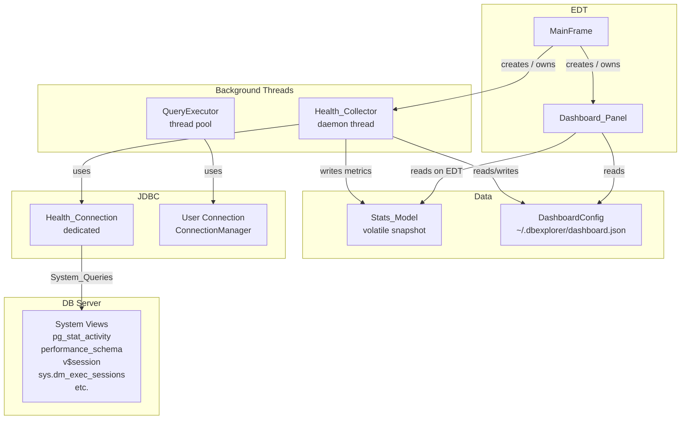

# Design Document: Database Health Dashboard

## Overview

The Database Health Dashboard is an opt-in panel embedded in the main DB Explorer window that
surfaces live statistics about the connected database server and the hosting JVM. It is
entirely read-only and runs on a dedicated daemon thread so it never competes with user
queries.

All server-side metrics (active sessions, query throughput, transactions, cache ratios, locks,
table/index scans, slow queries, database size) are pulled directly from the database's own
system views and tables via a dedicated Health_Connection. This means the dashboard reflects
activity from **all** clients connected to the server — not just DB Explorer — giving a true,
authoritative picture of server health.

The feature introduces three new components:

- **Health_Collector** – a background service that owns a dedicated JDBC connection, detects
  the `DatabaseType`, and polls the appropriate system views on a `ScheduledExecutorService`.
- **Stats_Model** – a thread-safe, in-memory snapshot holder read by the UI on the EDT.
- **Dashboard_Panel** – a `JPanel` embedded in `MainFrame` that renders the Stats_Model and
  reacts to theme changes.

Configuration (enabled/disabled state, poll interval) is persisted to
`~/.dbexplorer/dashboard.json` using the same Gson-based pattern already used by
`ConnectionManager`.

---

## Architecture



Key design decisions:

- **No shared connection**: `Health_Connection` is opened directly via `DriverManager` using
  the same `ConnectionInfo` credentials; it is never registered in `ConnectionManager`.
- **No application-level interception**: `QueryExecutor` is unchanged. There is no
  `QueryInterceptor` or `StatsAccumulator`. All query, transaction, session, and volume
  statistics come from the database server's own authoritative system views, reflecting all
  connected clients — not just DB Explorer.
- **DatabaseType dispatch**: `Health_Collector` inspects `ConnectionInfo.getDbType()` and
  executes the correct set of System_Queries for the connected engine. Unsupported metrics
  are silently omitted.
- **Single writer**: `Health_Collector` is the sole writer of all stats. It atomically
  replaces the entire snapshot via a `volatile StatsModel currentSnapshot` reference swap,
  eliminating the need for locks on individual fields.
- **EDT safety**: `Health_Collector` calls `SwingUtilities.invokeLater` to push each
  completed snapshot to `Dashboard_Panel`; the panel never reads `Stats_Model` from a
  background thread.

---

## Components and Interfaces

### Health_Collector

```java
package com.dbexplorer.health;

public class HealthCollector {
    // Lifecycle
    void start(ConnectionInfo info, DashboardConfig config);
    void stop();
    void applyConfig(DashboardConfig config);   // hot-reload interval

    // Internal (package-private for testing)
    void runPollCycle();
    boolean reconnect();
    ServerStats collectServerStats(Connection conn, DatabaseType dbType);
    List<LiveConnection> collectLiveConnections(Connection conn, DatabaseType dbType);
}
```

- Owns a single-thread `ScheduledExecutorService` (daemon thread named `"health-collector"`).
- Uses `scheduleWithFixedDelay` so overlapping cycles are impossible (Req 3.5).
- On each cycle:
  1. Validates connection via `isValid(2)`.
  2. Reads `DatabaseMetaData` (first cycle only).
  3. Dispatches to the appropriate `collect*Stats(conn)` method based on `DatabaseType`.
  4. Collects JVM stats via MXBeans.
  5. Reads `SQLWarning` chain from the Health_Connection.
  6. Calls `SwingUtilities.invokeLater` with the new snapshot.
- Reconnect logic: up to 3 attempts with 1-second sleep between attempts; on exhaustion sets
  `ConnectionStatus.FAILED` and cancels the scheduled task.

#### System Query Dispatch

```java
ServerStats collectServerStats(Connection conn, DatabaseType dbType) {
    return switch (dbType) {
        case POSTGRESQL -> collectPostgresStats(conn);
        case MYSQL      -> collectMysqlStats(conn);
        case ORACLE     -> collectOracleStats(conn);
        case SQLSERVER  -> collectSqlServerStats(conn);
        case SQLITE     -> collectSqliteStats(conn);
        case DYNAMODB   -> collectDynamoStats(conn);  // SDK/CloudWatch
        default         -> ServerStats.empty();
    };
}
```

Each `collect*Stats` method executes the appropriate system queries and maps results into a
`ServerStats` record. Any metric not available for a given engine is left `null` in the
record; `Dashboard_Panel` omits `null` rows from the display.

#### Generic JDBC Fallback

When `DatabaseType` is `GENERIC` — or any value not matched by the explicit cases above — the
`default` branch returns `ServerStats.empty()`. No system views are queried. The
`Health_Collector` still performs the full standard-JDBC collection pass:

| What is still collected | How |
|---|---|
| Connection health | `Connection.isValid(timeout)`, last check timestamp, reconnect count |
| Database metadata | `DatabaseMetaData`: product name/version, driver name/version, max connections, default transaction isolation, supported features (transactions, savepoints, batch updates, stored procedures), URL, username, read-only flag |
| SQL warnings | `Connection.getWarnings()` chain |
| JVM stats | `MemoryMXBean`, `ThreadMXBean`, `GarbageCollectorMXBean` — no DB connection needed |

None of these require engine-specific system views; they are available through the standard
`java.sql` and `java.lang.management` APIs for any compliant JDBC driver.

**Live Connections fallback**: `collectLiveConnections()` for `GENERIC` (and similarly for
`SQLITE` and `DYNAMODB`) returns a single-element list containing one `LiveConnection` row
built from `DatabaseMetaData`:

- `connectionId`: `"N/A"`
- `username`: `DatabaseMetaData.getUserName()`
- `host`: `DatabaseMetaData.getURL()`
- `state`: `"active"` (the Health_Connection is valid by definition at this point)
- `currentQuery`: `null` (rendered as `"—"`)
- `durationMs`: `null` (rendered as `"—"`)
- `isHealthConn`: `true`
- `note`:
  - GENERIC: `"Full connection list not available for this database type"`
  - SQLITE: `"SQLite is an embedded database; only one connection exists"`
  - DYNAMODB: `"DynamoDB is serverless; connection listing is not applicable"`

The note is displayed as a sub-label beneath the connections table in `Dashboard_Panel`.

**Dashboard_Panel behaviour for the fallback path**: rather than hiding the "Server Activity"
section entirely, the panel renders a single informational label inside that section:

> *"Server Activity statistics are not available for this database type. Connection health,
> metadata, warnings, and JVM stats are still collected."*

This makes the absence of server metrics explicit and reassures the user that the other four
sections are still fully populated.

**Rationale**: hiding the section would leave users confused about whether the dashboard is
working. Showing a clear message preserves discoverability and sets accurate expectations for
any JDBC-compliant database that is not one of the six explicitly supported engines.

#### System Queries per Engine

| Engine | System Views / Commands |
|---|---|
| PostgreSQL | `pg_stat_activity`, `pg_stat_database`, `pg_stat_user_tables`, `pg_stat_bgwriter` |
| MySQL/MariaDB | `information_schema`, `performance_schema.*`, `SHOW GLOBAL STATUS`, `SHOW PROCESSLIST` |
| Oracle | `v$session`, `v$sql`, `v$sysstat`, `v$waitstat` |
| SQL Server | `sys.dm_exec_sessions`, `sys.dm_exec_query_stats`, `sys.dm_os_wait_stats`, `sys.dm_exec_requests`, `sys.dm_exec_sql_text` |
| SQLite | `PRAGMA page_count`, `PRAGMA page_size`, `PRAGMA cache_size` |
| DynamoDB | SDK-level / CloudWatch metrics (where accessible) |

`collectLiveConnections` uses the same connections per engine:

| Engine | Live Connections Source | Columns mapped |
|---|---|---|
| PostgreSQL | `pg_stat_activity` | `pid`, `usename`, `client_addr`, `client_port`, `state`, `query` (80 chars), `now()-query_start` |
| MySQL/MariaDB | `performance_schema.processlist` / `SHOW PROCESSLIST` | `Id`, `User`, `Host`, `Command`, `Info` (80 chars), `Time*1000` |
| Oracle | `v$session` | `SID`, `SERIAL#`, `USERNAME`, `MACHINE`, `STATUS`, `PROGRAM`, `LOGON_TIME` |
| SQL Server | `sys.dm_exec_sessions` ⋈ `sys.dm_exec_requests` ⋈ `sys.dm_exec_sql_text` | `session_id`, `login_name`, `host_name`, `status`, `elapsed_time_ms`, `sql_text` (80 chars) |
| SQLite | `DatabaseMetaData` only | URL, username; note: "SQLite is an embedded database; only one connection exists" |
| DynamoDB | `DatabaseMetaData` only | URL, username; note: "DynamoDB is serverless; connection listing is not applicable" |
| GENERIC / other | `DatabaseMetaData` only | URL, username; note: "Full connection list not available for this database type" |

### Stats_Model

```java
package com.dbexplorer.health;

public final class StatsModel {
    // Connection health
    ConnectionStatus connectionStatus;   // VALID | INVALID | FAILED
    String           lastValidCheck;     // ISO-8601
    int              reconnectAttempts;

    // DB metadata (populated once)
    DbMetadata       dbMetadata;

    // Server-side activity stats (from system views)
    ServerStats      serverStats;

    // Warning log
    Deque<SqlWarningEntry> warningLog;   // max 100, circular

    // JVM stats
    JvmStats         jvmStats;

    // Meta
    Instant          lastRefreshed;
}
```

`StatsModel` is a plain data holder (no synchronisation). Thread safety is achieved by the
`Health_Collector` constructing a new `StatsModel` each cycle and publishing it via a single
`volatile StatsModel currentSnapshot` field in `HealthCollector`. The EDT reads only
`currentSnapshot`.

### Dashboard_Panel

```java
package com.dbexplorer.ui;

public class DashboardPanel extends JPanel {
    DashboardPanel(HealthCollector collector, DashboardConfig config);

    // Called by HealthCollector via invokeLater — must be on EDT
    void updateSnapshot(StatsModel snapshot);

    // Called by MainFrame when active connection changes
    void onConnectionChanged(ConnectionInfo info);

    // Called by ThemeManager after theme switch
    void applyTheme();
}
```

Internally composed of collapsible `JPanel` sections (one per requirement category), each
backed by a `JTable` or custom label grid. A `JProgressBar` renders heap usage. Rows for
metrics that are `null` in `ServerStats` are hidden automatically.

### DashboardConfig

```java
package com.dbexplorer.health;

public class DashboardConfig {
    boolean enabled;
    int     pollIntervalSeconds;          // 5–30, default 10
    Map<String, Boolean> enabledPerConnection;
}
```

Persisted to `~/.dbexplorer/dashboard.json` via Gson. Loaded at startup by `MainFrame`;
written whenever the user changes a setting.

---

## Data Models

### ConnectionStatus (enum)

```java
public enum ConnectionStatus { VALID, INVALID, FAILED }
```

### DbMetadata (record)

```java
public record DbMetadata(
    String  productName,
    String  productVersion,
    String  driverName,
    String  driverVersion,
    int     maxConnections,
    boolean supportsTransactions,
    boolean supportsSavepoints,
    boolean supportsBatchUpdates,
    boolean supportsStoredProcedures
) {}
```

### ServerStats (record)

All fields are nullable (`Long`, `Double`, `Integer`) so that unsupported metrics can be
represented as `null` and omitted from the UI rather than shown as misleading zeros.

```java
public record ServerStats(
    // Sessions / connections
    Integer activeSessionCount,       // all clients
    Integer totalConnectionCount,

    // Running queries
    List<ActiveQuery> activeQueries,  // queries currently executing

    // Live connections (all active sessions on the server)
    List<LiveConnection> liveConnections,

    // Throughput (cumulative from DB start or last reset)
    Long    totalQueriesExecuted,
    Long    totalCommits,
    Long    totalRollbacks,

    // Cache
    Double  cacheHitRatio,            // 0.0–1.0

    // Locks
    Long    lockWaitCount,
    Long    deadlockCount,

    // Scans
    Long    seqScanCount,
    Long    idxScanCount,

    // Slow queries
    Long    slowQueryCount,

    // Size
    Long    databaseSizeBytes
) {
    public static ServerStats empty() { return new ServerStats(null, null, List.of(),
        List.of(), null, null, null, null, null, null, null, null, null, null); }
}
```

### ActiveQuery (record)

```java
public record ActiveQuery(
    String pid,
    String state,
    String queryText,
    long   durationMs
) {}
```

### LiveConnection (record)

Represents a single active connection/session on the database server. Fields that are not
available for a given engine are set to `null`; the UI renders `"—"` for null cells.

```java
public record LiveConnection(
    String  connectionId,   // pid / Id / SID,SERIAL# / session_id
    String  username,       // usename / User / USERNAME / login_name
    String  host,           // client_addr:port / Host / MACHINE / host_name
    String  state,          // state / Command / STATUS / status
    String  currentQuery,   // query text truncated to 80 chars; null if idle
    Long    durationMs,     // query duration in ms; null if not running
    boolean isHealthConn,   // true when this row represents the Health_Connection
    String  note            // fallback/informational note; null for full-list engines
) {}
```

The `isHealthConn` flag is set by `HealthCollector` by comparing the session's connection ID
(or username + host) against the known identity of the Health_Connection. The
`Dashboard_Panel` renders rows where `isHealthConn == true` with a bold font or accent
background so the user can identify DB Explorer's own session.

### SqlWarningEntry (record)

```java
public record SqlWarningEntry(
    Instant timestamp,
    String  message,
    String  sqlState,
    int     errorCode
) {}
```

### JvmStats (record)

```java
public record JvmStats(
    long heapUsedBytes,
    long heapMaxBytes,
    int  liveThreadCount,
    long gcCollectionCount,
    long gcCollectionTimeMs
) {}
```

---

## Threading Model

```
Main Thread (EDT)
  └─ MainFrame constructs HealthCollector, DashboardPanel
  └─ DashboardPanel.updateSnapshot() called via invokeLater

health-collector (daemon, ScheduledExecutorService, single thread)
  └─ runPollCycle() every Poll_Interval seconds (scheduleWithFixedDelay)
      ├─ Connection.isValid(2)
      ├─ DatabaseMetaData (first cycle only)
      ├─ System_Queries via Health_Connection (dispatched by DatabaseType)
      ├─ MemoryMXBean / ThreadMXBean / GarbageCollectorMXBean
      ├─ Connection.getWarnings()
      └─ SwingUtilities.invokeLater → DashboardPanel.updateSnapshot(snapshot)

query-exec-N (daemon, QueryExecutor thread pool, 2–8 threads)
  └─ Unchanged — no interception, no wrapping
```

The `health-collector` thread never touches Swing components. The EDT never blocks on JDBC.
`QueryExecutor` is completely unmodified.

---

## Integration Points

### MainFrame

1. `MainFrame` constructs `HealthCollector` and `DashboardPanel` in its constructor.
2. A new toolbar button (using the existing `chart-bar.svg` icon) toggles `DashboardPanel`
   visibility and calls `HealthCollector.start()` / `stop()`.
3. `connectionListPanel.setOnConnect` callback is extended to call
   `healthCollector.start(info, config)` when the dashboard is enabled for that connection.
4. `initWindowBehavior` shutdown hook calls `healthCollector.stop()` before
   `queryExecutor.shutdown()`.
5. When the active connection changes (tab switch or new connection), `MainFrame` calls
   `dashboardPanel.onConnectionChanged(info)`.

### ConnectionManager

No changes to `ConnectionManager`. `HealthCollector` opens its own connection directly via
`DriverManager.getConnection(...)` using the credentials from `ConnectionInfo`, mirroring the
logic already in `ConnectionManager.connect()`.

### QueryExecutor

No changes to `QueryExecutor`. There is no wrapper, decorator, or interceptor.

### ThemeManager

`DashboardPanel` reads colours from `UIManager` (which FlatLaf populates) so it automatically
picks up theme changes when `SwingUtilities.updateComponentTreeUI` is called.

---

## Configuration Persistence

File: `~/.dbexplorer/dashboard.json`

```json
{
  "pollIntervalSeconds": 10,
  "enabledPerConnection": {
    "<connection-id-1>": true,
    "<connection-id-2>": false
  }
}
```

`DashboardConfig` is loaded by `MainFrame` at startup. It is saved whenever the user changes
the poll interval or toggles the dashboard for a connection.

---

## UI Layout Design

The `DashboardPanel` is added to `MainFrame` as a right-side collapsible panel inside the
existing horizontal `JSplitPane`. When hidden, the split pane divider collapses to zero width.

```
┌─────────────────────────────────────────────────────────────────────────┐
│  [●] Connection Health          Last refreshed: 2024-01-15 14:32:07    │
│  Status: VALID ●  Last check: 14:32:07  Reconnects: 0                  │
├─────────────────────────────────────────────────────────────────────────┤
│  [▼] Database Metadata                                                  │
│  Product:  PostgreSQL 16.2      Driver: PostgreSQL JDBC 42.7.3         │
│  Max Conn: 100                  Transactions: ✓  Savepoints: ✓         │
├─────────────────────────────────────────────────────────────────────────┤
│  [▼] Server Activity  (all clients)                                     │
│  Active sessions:    14         Total connections: 18                   │
│  Running queries:     2         (see list below)                        │
│  Total queries:  1,204,532      Commits: 48,201   Rollbacks: 312       │
│  Cache hit ratio:  98.7%        Lock waits: 3      Deadlocks: 0        │
│  Seq scans:      4,201          Index scans: 98,432                    │
│  Slow queries:      17          DB size: 2.4 GB                        │
│  ┌──────────────────────────────────────────────────────────────────┐  │
│  │ PID    State   Duration  Query                                   │  │
│  │ 12345  active  1,203 ms  SELECT * FROM orders WHERE ...          │  │
│  └──────────────────────────────────────────────────────────────────┘  │
├─────────────────────────────────────────────────────────────────────────┤
│  [▼] Live Connections  (all clients)                                    │
│  3 active connection(s)                                                 │
│  ┌──────────────────────────────────────────────────────────────────┐  │
│  │ Conn ID  Username  Host            State   Query        Duration │  │
│  │ **42**   **app**   **10.0.0.1:…**  active  SELECT …    1,203 ms │  │  ← Health_Connection (bold)
│  │ 17       analyst   10.0.0.5:51234  idle    —            —       │  │
│  │ 31       etl_user  10.0.0.9:60012  active  INSERT …    342 ms   │  │
│  └──────────────────────────────────────────────────────────────────┘  │
├─────────────────────────────────────────────────────────────────────────┤
│  [▼] SQL Warnings                                                       │
│  14:31:55  01000  Index hint ignored                                    │
├─────────────────────────────────────────────────────────────────────────┤
│  [▼] JVM Resources                                                      │
│  Heap: [████████████░░░░░░░░] 512 MB / 1024 MB (50%)                   │
│  Threads: 24   GC runs: 3   GC time: 45 ms                             │
└─────────────────────────────────────────────────────────────────────────┘
```

Implementation notes:
- Each section header is a `JButton` styled as a flat label that toggles section visibility.
- Metrics with a `null` value in `ServerStats` are hidden (row not rendered).
- The heap progress bar uses `JProgressBar`; foreground colour is amber (`#F59E0B`) above 70%
  and red (`#EF4444`) above 90%.
- All numeric labels use `NumberFormat.getNumberInstance(Locale.getDefault())`.
- The panel width is fixed at 300 px; the main split pane divider is adjusted when shown/hidden.
- FlatLaf `UIManager` keys are used directly so the panel inherits the active theme.
- The Live Connections `JTable` uses a custom `TableCellRenderer` that renders rows where
  `LiveConnection.isHealthConn() == true` with a bold `Font` and the theme's accent
  background colour, making DB Explorer's own session immediately identifiable.
- When `LiveConnection.note` is non-null, a `JLabel` with italic text is shown beneath the
  connections table to explain the fallback behaviour.

---

## Error Handling

| Scenario | Behaviour |
|---|---|
| Health_Connection fails to open | Retry up to 3×; set `FAILED`; stop polling; show red indicator |
| `isValid()` returns false | Attempt reconnect (same 3-retry logic); update `reconnectAttempts` |
| System_Query throws SQLException | Log to `System.err`; set that metric to `null` in snapshot; continue cycle |
| Poll cycle throws unexpected exception | Log to `System.err`; skip cycle; do not crash the thread |
| `dashboard.json` missing or corrupt | Use defaults; log warning; do not block startup |
| Connection switched while poll in flight | Next `invokeLater` callback checks active connection ID; stale snapshots are discarded |
| Metric not supported by DB engine | Field is `null` in `ServerStats`; Dashboard_Panel omits the row |
| `collectLiveConnections` throws SQLException | Log to `System.err`; set `liveConnections` to empty list in snapshot; continue cycle |
| DatabaseType is GENERIC or unknown | `collectServerStats()` returns `ServerStats.empty()`; `collectLiveConnections()` returns single-row fallback from `DatabaseMetaData`; Dashboard_Panel shows unavailability message in Server Activity section; all other sections (connection health, metadata, warnings, JVM) still populated |

---

## Testing Strategy

### Unit Tests

- `HealthCollectorTest`: verify reconnect logic (mock `Connection.isValid`), verify metadata
  is fetched only once, verify `FAILED` state after 3 failed reconnects, verify correct
  system-query dispatch per `DatabaseType`.
- `ServerStatsCollectorTest`: verify that each per-engine collector correctly maps result set
  rows to `ServerStats` fields; use in-memory H2 or mock `ResultSet`.
- `LiveConnectionCollectorTest`: verify that each per-engine `collectLiveConnections()`
  correctly maps result set columns to `LiveConnection` fields; verify the single-row
  fallback for GENERIC, SQLITE, and DYNAMODB; verify `isHealthConn` is set on the
  Health_Connection's own row.
- `DashboardConfigTest`: verify JSON round-trip, verify defaults when file is absent.

### Property-Based Tests

Property-based tests use **jqwik** (compatible with JUnit 5 / Maven). Each test runs a
minimum of 100 tries.

Tag format: `// Feature: db-health-dashboard, Property N: <property text>`


---

## Correctness Properties

*A property is a characteristic or behavior that should hold true across all valid executions
of a system — essentially, a formal statement about what the system should do. Properties
serve as the bridge between human-readable specifications and machine-verifiable correctness
guarantees.*

### Property 1: Enable-then-disable returns to stopped state

*For any* `ConnectionInfo`, enabling the dashboard and then disabling it should result in the
`HealthCollector` being in a stopped state and the `Health_Connection` being closed, regardless
of how many poll cycles ran in between.

**Validates: Requirements 1.3**

---

### Property 2: Disabled collector opens no connections

*For any* `ConnectionInfo`, if the dashboard is disabled, calling `runPollCycle()` should
neither open a JDBC connection nor execute any SQL statement.

**Validates: Requirements 1.4**

---

### Property 3: Dashboard config round-trip

*For any* `DashboardConfig` value (arbitrary enabled-per-connection map, poll interval in
[5,30]), serialising to JSON and deserialising should produce an equal config object.

**Validates: Requirements 1.5**

---

### Property 4: Reconnect exhaustion leads to FAILED status with accurate count

*For any* `HealthCollector` whose underlying connection always fails `isValid()`, after exactly
3 reconnect attempts the collector's status should be `ConnectionStatus.FAILED`, no further
poll cycles should be scheduled, and `reconnectAttempts` in the snapshot should equal 3.

**Validates: Requirements 2.3, 2.5, 4.3**

---

### Property 5: Poll interval validation

*For any* integer value, setting it as the poll interval should be accepted if and only if it
is in the range [5, 30] inclusive; values outside that range should be rejected with an
appropriate error.

**Validates: Requirements 3.1**

---

### Property 6: isValid result faithfully recorded with timestamp

*For any* mock connection whose `isValid()` returns a known boolean, after one poll cycle the
`Stats_Model`'s `connectionStatus` should be `VALID` when `isValid()` returned `true` and
`INVALID` when it returned `false`; and when `true`, the `lastValidCheck` field should be a
non-null, parseable ISO-8601 timestamp.

**Validates: Requirements 4.1, 4.2**

---

### Property 7: Database metadata fetched exactly once per session

*For any* `HealthCollector` that runs N polling cycles (N ≥ 2) with a healthy connection, the
`DatabaseMetaData` retrieval method should be invoked exactly once across all N cycles.

**Validates: Requirements 5.4**

---

### Property 8: DatabaseType dispatch routes to correct collector

*For any* `DatabaseType` value, `collectServerStats()` should invoke the corresponding
per-engine collection method (e.g. `collectPostgresStats` for `POSTGRESQL`) and no other
engine's collection method.

**Validates: Requirements 6.1**

---

### Property 9: ServerStats fields correctly mapped from system view results

*For any* mock `ResultSet` with known column values representing a system view row, the
per-engine `collect*Stats` method should map each column to the correct `ServerStats` field
with the correct numeric value.

**Validates: Requirements 6.2**

---

### Property 10: Null metrics are omitted from the display

*For any* `ServerStats` instance where a subset of fields are `null`, the rendered
`DashboardPanel` should not contain UI rows for those null fields, and should contain rows for
all non-null fields.

**Validates: Requirements 6.9**

---

### Property 11: Warning log never exceeds 100 entries and retains newest

*For any* number of `SQLWarning` entries added (including numbers greater than 100), the
warning log size should never exceed 100, and the most recently added entry should always be
present in the log.

**Validates: Requirements 7.1, 7.3**

---

### Property 12: Heap colour threshold logic

*For any* heap usage percentage P, the colour-selection function should return the default
accent colour when P ≤ 70, amber when 70 < P ≤ 90, and red when P > 90.

**Validates: Requirements 8.5**

---

### Property 13: Numeric formatting uses locale thousands separator

*For any* long value V ≥ 1000, the formatted string produced by the dashboard's number
formatter should contain the locale's grouping separator character.

**Validates: Requirements 9.6**

---

### Property 14: Generic JDBC fallback returns empty server stats and shows unavailability message

*For any* `DatabaseType` value that is not one of the six explicitly supported engines
(POSTGRESQL, MYSQL, ORACLE, SQLSERVER, SQLITE, DYNAMODB) — including `GENERIC` and any
future additions — `collectServerStats()` should return `ServerStats.empty()` (all
server-side fields null), and the `Dashboard_Panel` rendered with that snapshot should
display the message *"Server Activity statistics are not available for this database type.
Connection health, metadata, warnings, and JVM stats are still collected."* in the Server
Activity section.

**Validates: Requirements 6.11, 6.12**

---

### Property 15: Live connections list always contains the Health_Connection's own entry

*For any* supported engine (PostgreSQL, MySQL, Oracle, SQL Server), the list returned by
`collectLiveConnections()` should contain at least one entry where `isHealthConn == true`,
representing the Health_Connection's own session. For any unsupported engine (GENERIC,
SQLITE, DYNAMODB), `collectLiveConnections()` should return a list of exactly one entry
where `isHealthConn == true`, with `username` and `host` populated from
`DatabaseMetaData.getUserName()` and `DatabaseMetaData.getURL()` respectively, and a
non-null `note` field describing the limitation.

**Validates: Requirements 10.1, 10.6, 10.7, 10.8**

---

### Property 16: Live connections column mapping is correct per engine

*For any* mock result set with known column values representing a system view row for a
given engine, the `collectLiveConnections()` method should map each column to the correct
`LiveConnection` field: `connectionId`, `username`, `host`, `state`, `currentQuery`
(truncated to 80 chars), and `durationMs`.

**Validates: Requirements 10.2, 10.3, 10.4, 10.5**

---

### Property 17: Null LiveConnection fields render as "—"

*For any* `LiveConnection` instance where a subset of fields (`currentQuery`, `durationMs`,
`host`, etc.) are `null`, the `Dashboard_Panel`'s cell renderer should return the string
`"—"` for those cells and the actual value for non-null cells.

**Validates: Requirements 10.10**

---

### Property 18: Live connections row count label matches list size

*For any* list of `LiveConnection` records of size N, the row count label rendered by
`Dashboard_Panel` should display the text `"N active connection(s)"`.

**Validates: Requirements 10.11**

---

### Property 19: Health_Connection row is visually highlighted

*For any* `LiveConnection` list containing at least one entry where `isHealthConn == true`,
the `Dashboard_Panel`'s cell renderer for that row should return a bold `Font` or an accent
background colour distinct from the default row style, while all rows where
`isHealthConn == false` should use the default style.

**Validates: Requirements 10.13**
