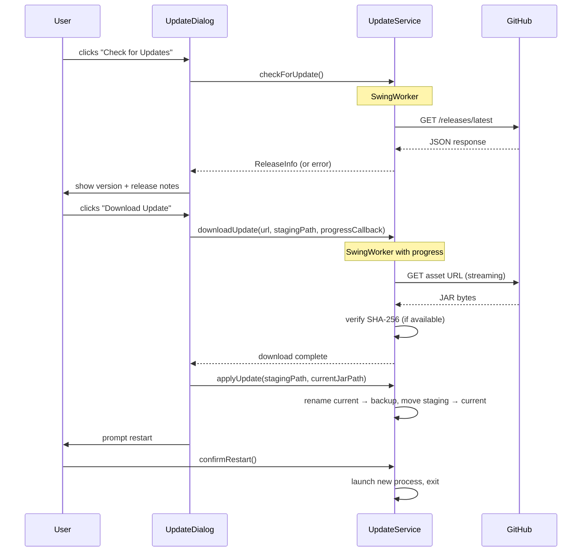

# Design Document: Self-Update Feature

## Overview

The self-update feature gives DB Explorer the ability to check GitHub Releases for newer versions, download the updated JAR, replace the running binary, and prompt the user to restart — all from within the application. Users can trigger a manual check from the Help menu or the About dialog, and optionally enable an automatic background check on startup.

The feature is implemented entirely in Java 17 using the existing project stack: Gson for JSON parsing, Apache HttpClient 5 for HTTP, and Java NIO for file operations. No new runtime dependencies are required.

---

## Architecture

The feature follows the existing layered pattern of the application:

```
UI Layer          Service Layer          External
─────────────     ──────────────         ────────
UpdateDialog  ←→  UpdateService     →    GitHub Releases API
MainFrame     ←→  UpdatePreferences →    ~/.dbexplorer/update-prefs.json
AboutDialog   ←→  (shared state)
```

A single `UpdateService` owns all network and file I/O. The UI layer (dialogs and menu items) delegates to it via `SwingWorker` tasks so the EDT is never blocked. A shared `AtomicBoolean` flag (`updateInProgress`) coordinates the disabled-state requirement across the Help menu item and the About dialog button.

### Startup Check Flow

```mermaid
sequenceDiagram
    participant App
    participant MainFrame
    participant UpdateService
    participant GitHub

    App->>MainFrame: setVisible(true)
    MainFrame->>UpdateService: scheduleStartupCheck()
    Note over UpdateService: SwingWorker (background thread)
    UpdateService->>GitHub: GET /releases/latest
    GitHub-->>UpdateService: JSON response
    UpdateService->>UpdateService: compareVersions()
    alt newer version found
        UpdateService->>MainFrame: showUpdateDialog(releaseInfo)
    else up to date
        UpdateService: log silently
    end
```

### Manual Check / Download Flow



---

## Components and Interfaces

### `UpdateService` (`com.dbexplorer.service.UpdateService`)

The core service. Stateless except for the shared `AtomicBoolean` flag passed in from the UI layer.

```java
public class UpdateService {

    /** Queries the GitHub Releases API and returns parsed release info. */
    public ReleaseInfo fetchLatestRelease() throws IOException;

    /**
     * Compares two semantic version strings.
     * Returns negative if a < b, 0 if equal, positive if a > b.
     */
    public static int compareVersions(String a, String b);

    /**
     * Downloads the asset at the given URL to stagingPath,
     * reporting progress via the callback. Cancellable via the flag.
     */
    public void downloadAsset(String url, Path stagingPath,
                              LongConsumer progressCallback,
                              AtomicBoolean cancelled) throws IOException;

    /**
     * Verifies the SHA-256 checksum of a file.
     * Returns true if checksum is null/blank (skip), or if it matches.
     */
    public boolean verifyChecksum(Path file, String expectedSha256) throws IOException;

    /**
     * Replaces currentJar with stagingFile.
     * Renames currentJar to currentJar.bak first.
     * Returns true on success.
     */
    public boolean applyUpdate(Path stagingFile, Path currentJar) throws IOException;

    /**
     * Launches a new JVM process with the updated JAR and exits.
     */
    public void restartWithJar(Path jarPath);

    /**
     * Resolves the path of the currently running JAR.
     * Returns empty Optional if running from a class directory (IDE/test).
     */
    public static Optional<Path> getCurrentJarPath();
}
```

### `ReleaseInfo` (`com.dbexplorer.service.ReleaseInfo`)

Immutable value object parsed from the GitHub Releases API response.

```java
public record ReleaseInfo(
    String tagName,       // e.g. "v2.6.0"
    String version,       // tagName stripped of leading "v"
    String body,          // release notes markdown
    String assetUrl,      // direct download URL for the JAR asset
    String assetName,     // filename of the JAR asset
    String checksumUrl    // URL of the .sha256 file, or null if absent
) {}
```

### `UpdatePreferences` (`com.dbexplorer.service.UpdatePreferences`)

Manages the single boolean preference for startup checks, persisted to `~/.dbexplorer/update-prefs.json`.

```java
public class UpdatePreferences {
    public boolean isStartupCheckEnabled();
    public void setStartupCheckEnabled(boolean enabled);
    public void save();
    public static UpdatePreferences load();
}
```

### `UpdateDialog` (`com.dbexplorer.ui.UpdateDialog`)

A modal `JDialog` that handles all update UI states:

| State | Content |
|---|---|
| Checking | Spinner + "Checking for updates…" |
| Up to date | "DB Explorer is up to date (v X.Y.Z)" |
| Update available | Version label, release notes area, Download button, startup-check checkbox |
| Downloading | Progress bar, bytes/total, Cancel button |
| Ready to restart | "Update downloaded. Restart to apply." + Restart button |
| Error | Error message text |

The dialog accepts an `AtomicBoolean updateInProgress` reference from `MainFrame` so it can set/clear the flag and notify the menu item and About dialog button.

### Integration Points

**`MainFrame.createMenuBar()`** — adds "Check for Updates…" `JMenuItem` to the Help menu above the separator before "About DB Explorer". The item is disabled while `updateInProgress` is true.

**`AboutDialog`** — adds a "Check for Updates…" `JButton` below the existing OK button. Disabled while `updateInProgress` is true.

**`App.main()`** — after `frame.setVisible(true)`, calls `UpdateService.scheduleStartupCheck(frame, prefs)` which fires a `SwingWorker` that waits for the window to be fully painted before running the check.

---

## Data Models

### GitHub Releases API Response (relevant fields)

```json
{
  "tag_name": "v2.6.0",
  "body": "## What's New\n- Feature A\n- Bug fix B",
  "assets": [
    {
      "name": "db-explorer-2.6.0.jar",
      "browser_download_url": "https://github.com/.../db-explorer-2.6.0.jar"
    },
    {
      "name": "db-explorer-2.6.0.jar.sha256",
      "browser_download_url": "https://github.com/.../db-explorer-2.6.0.jar.sha256"
    }
  ]
}
```

The updater selects the asset whose name ends with `.jar` (excluding `.sha256`). The checksum asset is identified by the `.sha256` suffix on the JAR asset name.

### `update-prefs.json`

```json
{
  "startupCheckEnabled": true
}
```

Stored at `~/.dbexplorer/update-prefs.json`, consistent with the existing `ai-configs.json` location pattern.

### File Paths During Update

| Path | Description |
|---|---|
| `/path/to/db-explorer-2.5.0.jar` | Current running JAR (`getCurrentJarPath()`) |
| `/path/to/db-explorer-2.6.0.jar.download` | Staging file during download |
| `/path/to/db-explorer-2.5.0.jar.bak` | Backup of old JAR after replacement |
| `/path/to/db-explorer-2.5.0.jar` | New JAR after `Files.move(staging, current)` |


---

## Correctness Properties

*A property is a characteristic or behavior that should hold true across all valid executions of a system — essentially, a formal statement about what the system should do. Properties serve as the bridge between human-readable specifications and machine-verifiable correctness guarantees.*

### Property 1: Semantic Version Comparison Ordering

*For any* two valid semantic version strings `a` and `b`, `compareVersions(a, b)` must satisfy the total-order axioms: if `a < b` then `compareVersions(a, b) < 0`; if `a == b` then `compareVersions(a, b) == 0`; if `a > b` then `compareVersions(a, b) > 0`. Additionally, for any three versions `a`, `b`, `c`, if `a ≤ b` and `b ≤ c` then `a ≤ c` (transitivity).

**Validates: Requirements 1.2**

### Property 2: API Response Parsing Round-Trip

*For any* valid GitHub Releases API JSON response containing `tag_name`, `body`, and an `assets` array with a `.jar` entry, parsing the response into a `ReleaseInfo` should correctly extract the version (tag stripped of leading "v"), the release notes body, and the asset download URL — and re-serializing those fields should produce values equal to the originals.

**Validates: Requirements 1.1, 5.1**

### Property 3: Dialog State Determined by Version Comparison

*For any* current version string and latest version string, the update availability state (update available vs. up to date) returned by the check logic must equal `compareVersions(latest, current) > 0`. The state must be consistent regardless of the order in which the strings are presented.

**Validates: Requirements 1.3, 1.4**

### Property 4: Checksum Verification Correctness

*For any* file and expected SHA-256 hex string: (a) if the expected checksum is null or blank, `verifyChecksum` must return `true` (skip); (b) if the expected checksum matches the file's actual SHA-256 digest, `verifyChecksum` must return `true`; (c) if the expected checksum does not match the file's actual digest, `verifyChecksum` must return `false`. This must hold for files of any size and content.

**Validates: Requirements 3.4, 3.5**

### Property 5: Staging File Placed in Same Directory as Current JAR

*For any* valid current JAR path, the staging file path computed by the updater must have the same parent directory as the current JAR path, and must have a distinct filename (e.g., a `.download` suffix).

**Validates: Requirements 3.1**

### Property 6: JAR Replacement Preserves New Content

*For any* staging file with known byte content and any current JAR path, after `applyUpdate(stagingFile, currentJar)` succeeds: the bytes at `currentJar` must equal the original staging file bytes, and a backup file (`.bak`) must exist in the same directory.

**Validates: Requirements 4.1**

### Property 7: Preference Persistence Round-Trip

*For any* boolean value of `startupCheckEnabled`, writing it via `UpdatePreferences.setStartupCheckEnabled(v)` followed by `save()` and then `UpdatePreferences.load()` must return a preferences object where `isStartupCheckEnabled()` equals `v`.

**Validates: Requirements 2.5**

---

## Error Handling

| Scenario | Behavior |
|---|---|
| GitHub API unreachable / timeout (10 s) | `UpdateService` throws `IOException`; dialog shows error message; `updateInProgress` cleared |
| API returns non-200 status | Treated as failure; error message shown with HTTP status code |
| Asset URL missing from release | Error: "No JAR asset found in this release" |
| Download interrupted (network drop) | Staging file deleted; error message shown |
| Checksum mismatch | Staging file deleted; integrity error shown |
| JAR replacement permission denied | Staging file retained; manual instructions shown with staging file path |
| Current JAR path undetermined | Error shown; "Save As…" fallback offered |
| Startup check fails silently | Exception caught and logged to console; no dialog shown |

All network operations use a 10-second connect timeout and a 30-second read timeout via `HttpClient` configuration. All file operations use `try-finally` or `try-with-resources` to ensure cleanup.

---

## Testing Strategy

### Dual Testing Approach

Both unit tests and property-based tests are required. Unit tests cover specific examples, integration points, and error conditions. Property-based tests verify universal correctness across generated inputs.

### Property-Based Testing

The project already uses **jqwik 1.8.4** (present in `pom.xml`). Each property test runs a minimum of 100 tries (jqwik default; override with `@Property(tries = 100)`).

Each property test must be tagged with a comment referencing the design property:
```
// Feature: self-update, Property N: <property text>
```

**Property test file:** `src/test/java/com/dbexplorer/service/UpdateServicePropertyTest.java`

| Design Property | Test Method | Pattern |
|---|---|---|
| P1: Version comparison ordering | `versionComparisonIsTransitive()`, `versionComparisonIsAntisymmetric()` | Invariant |
| P2: API response parsing | `apiResponseParsingRoundTrip()` | Round-trip |
| P3: Dialog state from comparison | `dialogStateMatchesVersionComparison()` | Model-based |
| P4: Checksum verification | `checksumVerificationCorrectness()` | Error conditions + invariant |
| P5: Staging file location | `stagingFileIsInSameDirectoryAsJar()` | Invariant |
| P6: JAR replacement content | `jarReplacementPreservesContent()` | Round-trip |
| P7: Preference persistence | `preferenceRoundTrip()` | Round-trip |

### Unit Tests

**Test file:** `src/test/java/com/dbexplorer/service/UpdateServiceTest.java`

- `testVersionComparisonExamples()` — spot-check known version pairs (e.g., `2.5.0 < 2.6.0`, `2.5.0 == 2.5.0`, `2.10.0 > 2.9.0`)
- `testApiParsingWithMissingBody()` — release notes fallback to empty string when `body` is null
- `testApiParsingWithNoJarAsset()` — error when no `.jar` asset present
- `testChecksumSkippedWhenNull()` — `verifyChecksum(file, null)` returns true
- `testChecksumSkippedWhenBlank()` — `verifyChecksum(file, "")` returns true
- `testDownloadCancelledCleansUpStagingFile()` — staging file absent after cancel
- `testDownloadFailureCleansUpStagingFile()` — staging file absent after IOException
- `testApplyUpdateCreatesBackup()` — `.bak` file exists after replacement
- `testApplyUpdateFailureRetainsStagingFile()` — staging file retained when replacement fails
- `testGetCurrentJarPathFromClassDirectory()` — returns empty Optional when running from classes dir
- `testPreferenceDefaultsToEnabled()` — fresh load with no file returns `true`
- `testReleaseNotesEmptyFallback()` — `body == null` → "No release notes available for this version."
