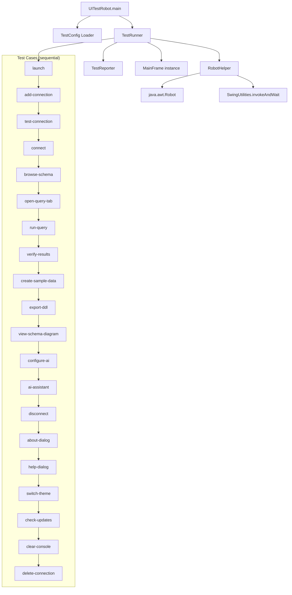

# Design Document: UI Test Robot

## Overview

The UI Test Robot is a standalone Java main class (`com.dbexplorer.test.UITestRobot`) that automates end-to-end testing of the DB Explorer Swing application. It runs in the same JVM, launches `MainFrame` programmatically, and uses `java.awt.Robot` to simulate mouse clicks, keyboard input, and menu navigation. A JSON configuration file supplies database connection properties and optional AI settings. The robot executes 20 sequential test cases covering the full application lifecycle — from connection creation through schema browsing, query execution, sample data creation, DDL export, schema diagram, AI features, and cleanup — producing a PASS/FAIL/SKIP report for each.

The design prioritizes reliability through EDT-safe component lookups, configurable timing, polling-based waits, and per-test error isolation.

## Architecture



The architecture is a single-class design with helper methods organized into logical groups:

1. **Configuration** — JSON parsing via Gson into a `TestConfig` record
2. **Robot Helpers** — component finding, clicking, typing, waiting utilities wrapping `java.awt.Robot` and `SwingUtilities.invokeAndWait`
3. **Test Cases** — 20 sequential methods, each wrapped in try-catch for error isolation
4. **Reporting** — stdout logging with PASS/FAIL/SKIP status and timing per test case, plus a summary

All component lookups traverse the Swing component hierarchy on the EDT via `invokeAndWait`. The robot uses polling loops (100ms intervals) with configurable timeouts to wait for dialogs and components to appear.

## Components and Interfaces

### TestConfig (inner record or static class)

Parsed from the JSON configuration file. Fields:

| Field | Type | Required | Description |
|-------|------|----------|-------------|
| `connectionName` | String | yes | Display name for the test connection |
| `databaseType` | String | yes | Must match `DatabaseType` enum (POSTGRESQL, MYSQL, etc.) |
| `host` | String | yes | Database host |
| `port` | int | yes | Database port |
| `databaseName` | String | yes | Database/schema name |
| `username` | String | yes | DB username |
| `password` | String | yes | DB password |
| `query` | String | no | Custom SELECT for the run-query test (default: `SELECT 1`) |
| `ddlScriptPath` | String | no | Path to external SQL file for sample data |
| `aiProvider` | String | no | AI provider name (e.g. "OpenAI") |
| `aiModel` | String | no | AI model name (e.g. "gpt-4o") |
| `aiBaseUrl` | String | no | AI API base URL |
| `aiApiKey` | String | no | AI API key |
| `aiPrompt` | String | no | Custom prompt for AI assistant test |

### RobotHelper Methods

Core utility methods that wrap `java.awt.Robot` and EDT-safe lookups:

- `delay(ms)` — Thread.sleep with configurable default (500ms)
- `findComponent(container, type, predicate)` — EDT-safe recursive search via `invokeAndWait`
- `findComponentByName(container, name)` — find by component name property
- `findDialog(titleSubstring, timeoutMs)` — poll for a visible dialog matching title
- `findButton(container, textOrTooltip)` — find JButton by text or tooltip
- `clickComponent(component)` — move mouse to component center, click
- `clickButton(container, textOrTooltip)` — find + click a button
- `typeText(text)` — type string character by character via Robot key events
- `pressKey(keyCode)` — single key press
- `pressCtrlKey(keyCode)` — Ctrl+key combo
- `waitForCondition(predicate, timeoutMs, description)` — poll at 100ms intervals
- `getTreeNodeByText(tree, text)` — find a JTree node by user object toString
- `expandTreeNode(tree, path)` — expand a tree path
- `doubleClickTreeNode(tree, node)` — double-click a tree row
- `rightClickTreeNode(tree, node)` — right-click to trigger popup menu
- `clickMenuItem(popupMenu, text)` — find and click a menu item
- `clickMenuBarItem(menuBar, menuText, itemText)` — navigate menu bar → menu → item

### TestReporter

Simple reporting utility:

- `reportPass(testName, durationMs)` — logs `[PASS] testName (Xms)`
- `reportFail(testName, durationMs, reason)` — logs `[FAIL] testName (Xms): reason`
- `reportSkip(testName, reason)` — logs `[SKIP] testName: reason`
- `printSummary()` — prints total/passed/failed/skipped counts

### Test Case Methods

Each test case is a separate method with signature `void testXxx()`. Each is wrapped in a try-catch in the runner loop. The methods access the shared `MainFrame` reference, `Robot` instance, and `TestConfig`.

## Data Models

### TestConfig JSON Format

```json
{
  "connectionName": "Test PostgreSQL",
  "databaseType": "POSTGRESQL",
  "host": "localhost",
  "port": 5432,
  "databaseName": "testdb",
  "username": "testuser",
  "password": "testpass",
  "query": "SELECT * FROM pg_tables LIMIT 5",
  "ddlScriptPath": null,
  "aiProvider": "OpenAI",
  "aiModel": "gpt-4o",
  "aiBaseUrl": "https://api.openai.com/v1",
  "aiApiKey": "sk-...",
  "aiPrompt": "Show all tables in the database"
}
```

### TestResult (internal tracking)

```java
record TestResult(String name, Status status, long durationMs, String failureReason) {
    enum Status { PASS, FAIL, SKIP }
}
```

### Supply Chain DDL Schema

The embedded DDL script creates 7 tables with foreign key relationships:

```
suppliers (supplier_id PK, name, contact_email, country, rating)
    ↑
products (product_id PK, name, sku, category, unit_price, supplier_id FK)
    ↑                                                          ↑
order_items (item_id PK, order_id FK, product_id FK, quantity, unit_price)
    ↑                                                    
purchase_orders (order_id PK, supplier_id FK, order_date, status, total_amount)
    ↑
shipments (shipment_id PK, order_id FK, warehouse_id FK, ship_date, arrival_date, tracking_number, status)
    ↑
warehouses (warehouse_id PK, name, location, capacity)
    ↑
inventory (inventory_id PK, product_id FK, warehouse_id FK, quantity, last_restocked)
```

The DDL is embedded as a static String constant in the test class. If `ddlScriptPath` is set in the config, the file contents are used instead. The DDL uses standard SQL (CREATE TABLE, PRIMARY KEY, FOREIGN KEY REFERENCES) and includes INSERT statements with at least 3 rows per table.

### Component Lookup Strategy

The robot finds components by traversing the Swing hierarchy:

1. **Dialogs** — `Window.getWindows()` filtered by `JDialog` instances with matching title
2. **Toolbar buttons** — traverse `JToolBar` children, match by tooltip text
3. **Menu items** — `JMenuBar` → `JMenu` → `JMenuItem` by text
4. **Tree nodes** — `JTree.getModel()` traversal, match by `toString()` of user object
5. **Text fields** — type-based search within dialog containers
6. **Combo boxes** — type-based search, select item by string match

All lookups run on the EDT via `SwingUtilities.invokeAndWait` to ensure thread safety.

### Timing Configuration

| Parameter | Default | Description |
|-----------|---------|-------------|
| Action delay | 500ms | Pause between UI actions |
| Poll interval | 100ms | Interval for waiting loops |
| Dialog timeout | 5000ms | Max wait for dialog appearance |
| Connection timeout | 15000ms | Max wait for DB connection |
| Query timeout | 30000ms | Max wait for query results |
| Launch timeout | 10000ms | Max wait for MainFrame visibility |


## Correctness Properties

*A property is a characteristic or behavior that should hold true across all valid executions of a system — essentially, a formal statement about what the system should do. Properties serve as the bridge between human-readable specifications and machine-verifiable correctness guarantees.*

Most of this feature's acceptance criteria involve UI interactions (clicking buttons, navigating menus, verifying dialog contents) that require a live Swing environment and are not amenable to property-based testing. However, the configuration parsing, test reporting, and test runner control flow logic are pure functions that can be thoroughly validated with properties.

### Property 1: Config parsing round trip

*For any* valid `TestConfig` object with all required fields (connectionName, databaseType, host, port, databaseName, username, password) and any combination of optional fields (query, ddlScriptPath, aiProvider, aiModel, aiBaseUrl, aiApiKey, aiPrompt), serializing to JSON and parsing back should produce an equivalent `TestConfig`.

**Validates: Requirements 1.2, 1.5, 21.1, 23.5**

### Property 2: Invalid config rejection

*For any* JSON string that is either syntactically invalid or a valid JSON object missing one or more required fields (connectionName, databaseType, host, port, databaseName, username, password), parsing should throw an exception or return an error — never a valid `TestConfig`.

**Validates: Requirements 1.4**

### Property 3: Test report formatting

*For any* `TestResult` (with arbitrary name string, status of PASS/FAIL/SKIP, non-negative duration, and optional failure reason), the formatted report line should contain the test name, the status string, and the duration in milliseconds. When the status is FAIL, the report line should also contain the failure reason.

**Validates: Requirements 17.1, 17.2**

### Property 4: Test summary and exit code correctness

*For any* non-empty list of `TestResult` values, the summary should report `total == list.size()`, `passed == count of PASS`, `failed == count of FAIL`, and `skipped == count of SKIP`. The computed exit code should be 0 if and only if the failed count is zero.

**Validates: Requirements 17.3, 17.4**

### Property 5: AI test cases skip when AI config is absent

*For any* `TestConfig` where `aiProvider` is null or `aiApiKey` is null, the test runner's `shouldSkipAI()` check should return true. Conversely, for any `TestConfig` where both `aiProvider` and `aiApiKey` are non-null and non-empty, `shouldSkipAI()` should return false.

**Validates: Requirements 21.2**

### Property 6: Error isolation — runner continues after test failure

*For any* sequence of test case functions where one or more throw exceptions, the test runner should execute all test cases in the sequence (not stop at the first failure) and produce a `TestResult` for every test case in the list.

**Validates: Requirements 18.4**

## Error Handling

| Scenario | Handling |
|----------|----------|
| Config file not found | Log error with file path, exit code 1 |
| Invalid JSON in config | Log parse error with details, exit code 1 |
| Missing required config field | Log which field is missing, exit code 1 |
| MainFrame fails to launch | Report launch test as FAIL, skip remaining tests, exit code 1 |
| Dialog does not appear within timeout | Report that test case as FAIL, continue to next test |
| Component not found | Report test case as FAIL with component description, continue |
| Unexpected exception in test case | Catch in try-catch wrapper, report FAIL with exception message, continue |
| Database connection failure | Report connect test as FAIL, subsequent DB-dependent tests will also fail individually |
| AI config not provided | Skip AI test cases with SKIP status (not FAIL) |
| Robot security exception | Log error (may need `-Djava.awt.Robot.allowAccess=true`), exit code 1 |

Each test case method is wrapped in a try-catch block at the runner level:

```java
for (Runnable testCase : testCases) {
    long start = System.currentTimeMillis();
    try {
        testCase.run();
        reporter.reportPass(testName, System.currentTimeMillis() - start);
    } catch (Exception e) {
        reporter.reportFail(testName, System.currentTimeMillis() - start, e.getMessage());
    }
}
```

This ensures a failure in one test never prevents subsequent tests from running.

## Testing Strategy

### Unit Tests

Unit tests cover the non-UI logic that can be tested without a display:

- **Config parsing**: Valid JSON → correct `TestConfig` fields, missing fields → error, invalid JSON → error, optional fields present/absent
- **Report formatting**: PASS/FAIL/SKIP output format, failure reason inclusion
- **Summary computation**: Correct counts from mixed result lists, exit code logic
- **AI skip logic**: Various combinations of aiProvider/aiApiKey presence
- **Test sequence**: Verify the defined test case order matches requirements

These are standard JUnit 5 tests with specific examples and edge cases.

### Property-Based Tests

Property-based tests use **jqwik** (already in the project's `pom.xml`) to validate universal properties across generated inputs. Each property test runs a minimum of 100 iterations.

| Property | Test Description | Tag |
|----------|-----------------|-----|
| Property 1 | Generate random TestConfig, serialize to JSON, parse back, assert equality | Feature: ui-test-robot, Property 1: Config parsing round trip |
| Property 2 | Generate invalid JSON strings and JSON missing required fields, assert parse failure | Feature: ui-test-robot, Property 2: Invalid config rejection |
| Property 3 | Generate random TestResult values, format report, assert contains name/status/duration/reason | Feature: ui-test-robot, Property 3: Test report formatting |
| Property 4 | Generate random lists of TestResult, compute summary, assert counts and exit code | Feature: ui-test-robot, Property 4: Test summary and exit code correctness |
| Property 5 | Generate TestConfig with/without AI fields, assert shouldSkipAI() matches | Feature: ui-test-robot, Property 5: AI test cases skip when AI config is absent |
| Property 6 | Generate sequence of test functions (some throwing), run through runner, assert all produce results | Feature: ui-test-robot, Property 6: Error isolation |

Each property-based test must:
- Be implemented as a single `@Property` method in jqwik
- Run at least 100 iterations (`@Property(tries = 100)`)
- Include a comment referencing the design property number and text
- Use jqwik's `@ForAll` generators for input generation

### Integration / E2E Tests

The UI test robot itself IS the integration test. It is run manually or in CI with a real database:

```bash
java -cp db-explorer.jar com.dbexplorer.test.UITestRobot test-config.json
```

The robot produces stdout output like:
```
[PASS] launch (1234ms)
[PASS] add-connection (2100ms)
[FAIL] test-connection (5023ms): Connection refused
...
=== Test Summary ===
Total: 20 | Passed: 18 | Failed: 1 | Skipped: 1
```
